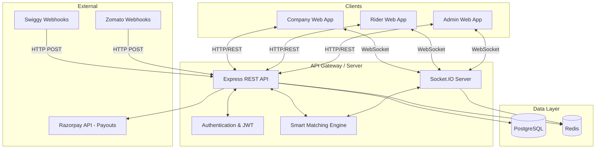

# Project Documentation: Gig Workforce Platform

This document serves as an in-depth technical guide to the Gig Workforce Platform. It details the technologies used, High-Level Design (HLD), Low-Level Design (LLD), and the architecture behind the system.

---

## 1. Overview & Vision
The platform is designed as an "Operating System" for gig workforce management. It connects two primary sides of a marketplace:
1.  **Companies**: Businesses (or aggregated external partners like Swiggy/Zomato via webhooks) that need immediate delivery or task fulfillment.
2.  **Riders**: Independent workers looking for gig opportunities in their vicinity.

The system emphasizes **real-time interactions** (sub-200ms gig broadcasting), **trust** (KYC gating), and **financial settlement** (UPI wallet payouts).

---

## 2. Technology Stack

### Frontend (Client)
- **Framework:** React 18, utilizing functional components and hooks.
- **Build Tool:** Vite for fast HMR and optimized production bundling.
- **Styling:** Tailwind CSS combined with custom CSS variables (in `index.css`) for a "glassmorphism" premium dark-mode aesthetic. `clsx` is used for conditional class joining.
- **Routing:** React Router v6.
- **Data Fetching:** TanStack Query (React Query) for caching, refetching, and state management of REST API calls.
- **Real-Time Communication:** `socket.io-client` for maintaining persistent WebSocket connections.

### Backend (Server)
- **Runtime:** Node.js.
- **Web Framework:** Express.js for RESTful API routes.
- **Real-Time Server:** Socket.IO for broadcasting events (gigs, notifications) to specific user rooms.
- **Database ORM:** Prisma ORM for type-safe database queries and schema management.
- **Language:** TypeScript across the entire stack (enforced via npm workspaces/monorepo).

### Infrastructure & Data Stores
- **Primary Database:** PostgreSQL 16. Chosen for strong relational integrity, ACID compliance, and geospatial capabilities (though currently handled via application logic).
- **In-Memory Cache / Broker:** Redis 7. Used primarily (conceptually or practically depending on scale) for managing socket rooms across multiple instances and caching hot data (like active rider locations).
- **Containerization:** Docker & Docker Compose for local database spin-ups.

---

## 3. High-Level Design (HLD)

The architecture follows a classic Client-Server model augmented with a Real-Time WebSocket layer and an external Webhook ingestion layer.

### System Architecture Diagram

### Key Flows
1. **Gig Creation Flow:** A Company (or external webhook) posts a gig. The API saves it to Postgres. The `Realtime` service immediately pushes this gig via WebSockets to all `Riders` who are marked "online".
2. **Acceptance Flow:** A Rider clicks "Accept". The API checks for race conditions (has it been taken?), assigns the gig, and broadcasts a `gig:updated` event to remove it from other riders' boards.
3. **Payout Flow:** Rider completes a gig. The assignment status changes, and a `Payout` record is created. The Rider can request a withdrawal, which (in a production setting) talks to a payment gateway like Razorpay.

---

## 4. Low-Level Design (LLD)

### Database Schema (Prisma)
The database is highly relational. Key entities include:

- **User**: The base authentication entity. Has a `Role` enum (`ADMIN`, `COMPANY`, `RIDER`).
- **Company**: Extends the User. Owns `Zone`s and `Gig`s.
- **Rider**: Extends the User. Contains live state (`isOnline`, `lastLat`, `lastLng`), financial state (`walletBalance`), and traits (`platformTags`).
- **Gig**: The core transaction unit. Contains pricing (`payAmount`), location data (`pickupZone`, `serviceArea`), and `status` (`OPEN`, `ASSIGNED`, `IN_PROGRESS`, `COMPLETED`, `CANCELLED`).
- **Assignment**: The junction table between a `Gig` and a `Rider` representing the active or completed job.
- **Payout & Withdrawal**: Financial ledgers tracking earnings per gig and requested bank transfers.
- **KycSubmission**: Identity verification documents tied to a Rider.

### Core Modules (Backend)
1. **`routes/*`**: Express controllers handling HTTP requests.
   - `auth.ts`: JWT generation and login.
   - `gigs.ts`: CRUD for gigs, including the critical POST endpoint that triggers WebSocket broadcasts.
   - `riders.ts`: Rider state management (toggling online/offline, location updates).
2. **`realtime/socket.ts`**: The WebSocket hub.
   - Authenticates connections via JWT.
   - Joins users to specific rooms (e.g., `company_XYZ`, `rider_ABC`, `admin`).
   - Emits events like `gig:new`, `gig:updated`, `notification:new`.
3. **`services/smart-matching.ts`**:
   - Algorithms to score and sort gigs for a specific rider.
   - *Logic:* Factors in Urgency (CRITICAL = highest weight), Pay bonuses, Platform Tag overlaps (e.g., if a rider has the 'swiggy' tag and the gig prefers 'swiggy'), and geospatial distance.
4. **`services/partner-callbacks.ts`**:
   - A retry-worker system. If a gig originated from a partner webhook (Swiggy), the system will attempt to call back the partner's URL when the gig is completed. If it fails, it utilizes the `WebhookDelivery` table to retry with exponential backoff.

### Core Modules (Frontend)
1. **`components/ui.tsx`**: A bespoke design system built on top of Tailwind. Features glassmorphism (`glass-card`), gradient borders, and reusable structural elements (`Card`, `Button`, `SectionHeader`, `StatCard`, `Toast`).
2. **`context/AuthContext.tsx`**: Manages global user state, handles login, and stores the JWT in local storage.
3. **`lib/socket.ts`**: A singleton wrapper around `socket.io-client` that automatically connects when the user logs in and listens for global events (like toast notifications).
4. **Pages**:
   - `LandingPage.tsx`: Marketing site highlighting value propositions.
   - `LoginPage.tsx`: Split-screen authentication.
   - `RiderPage.tsx`: The worker's view. Displays a live-updating gig board, wallet balance, and KYC status.
   - `CompanyPage.tsx`: The demand side. Allows posting gigs and viewing active fulfillment.
   - `AdminPage.tsx`: The control room. Features a `Live Ops Map` (mocked in UI, but designed for real geospatial coordinates), user management, and KYC approvals.

---

## 5. Security & Authentication
- **Authentication:** Stateless JWT (JSON Web Tokens). Issued on login, passed via `Authorization: Bearer <token>` header for REST calls, and passed in the `auth` payload during Socket.IO connection.
- **Authorization:** Handled at the route level via middleware (e.g., `requireRole(Role.ADMIN)`). Frontend routes are protected using the `<ProtectedRoute>` wrapper.
- **Data Validation:** Zod schemas (in `packages/shared`) are used to strictly validate incoming request payloads before they touch the database.

---

## 6. Future Scalability Considerations
- **Geospatial Queries:** Currently, matching relies on string-based zones or basic math. Moving to PostGIS (PostgreSQL extension) will allow for highly performant `ST_DWithin` radius queries to find riders strictly within X kilometers.
- **Redis Pub/Sub:** As the Node.js API scales horizontally across multiple servers, Socket.IO needs a Redis Adapter to broadcast events across different instances.
- **Message Queues:** Payout processing and Webhook retries should eventually move to a robust queueing system like RabbitMQ or AWS SQS to prevent dropped tasks during server restarts.
