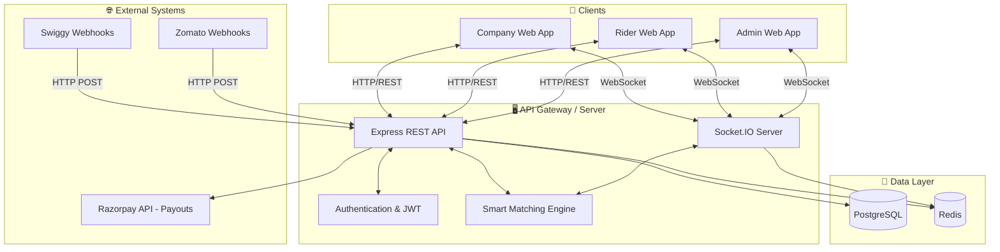
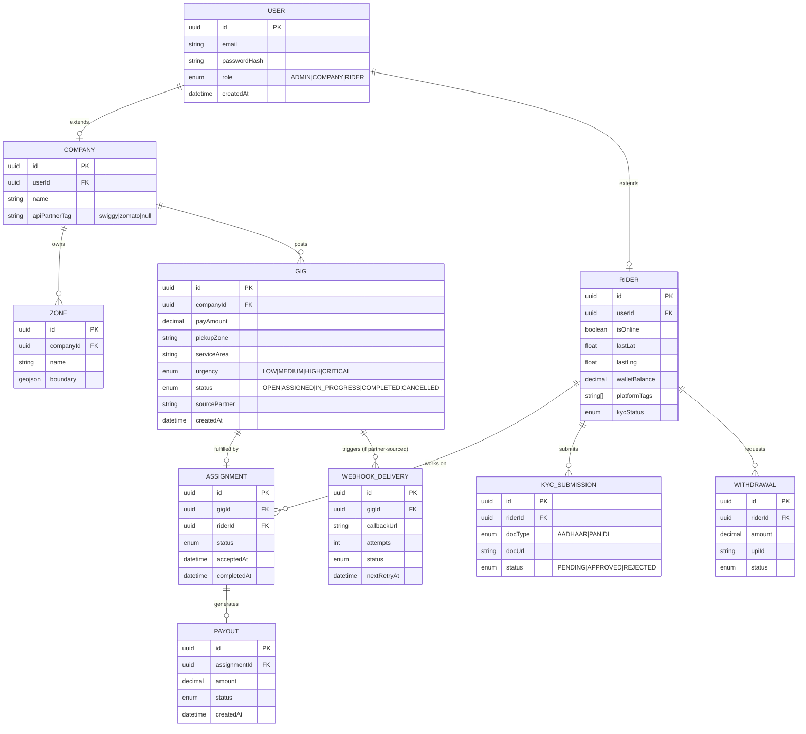
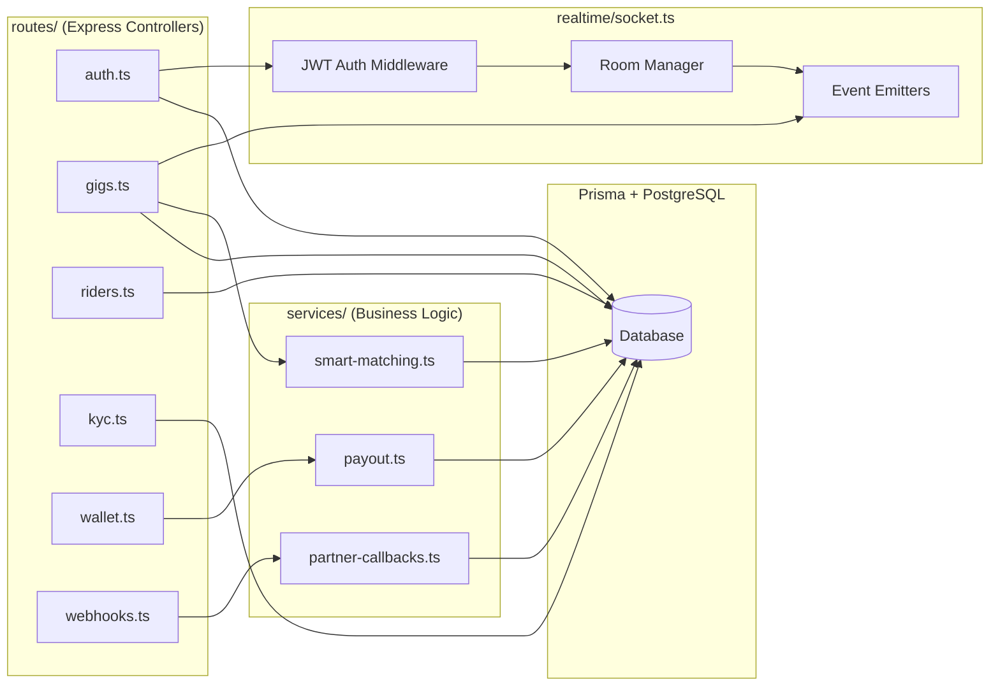
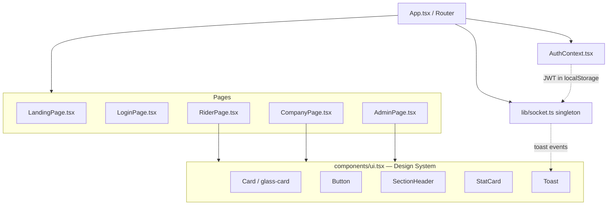
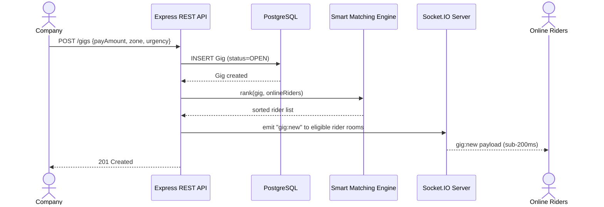
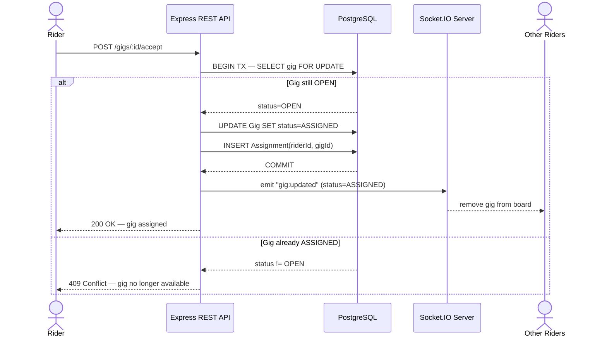
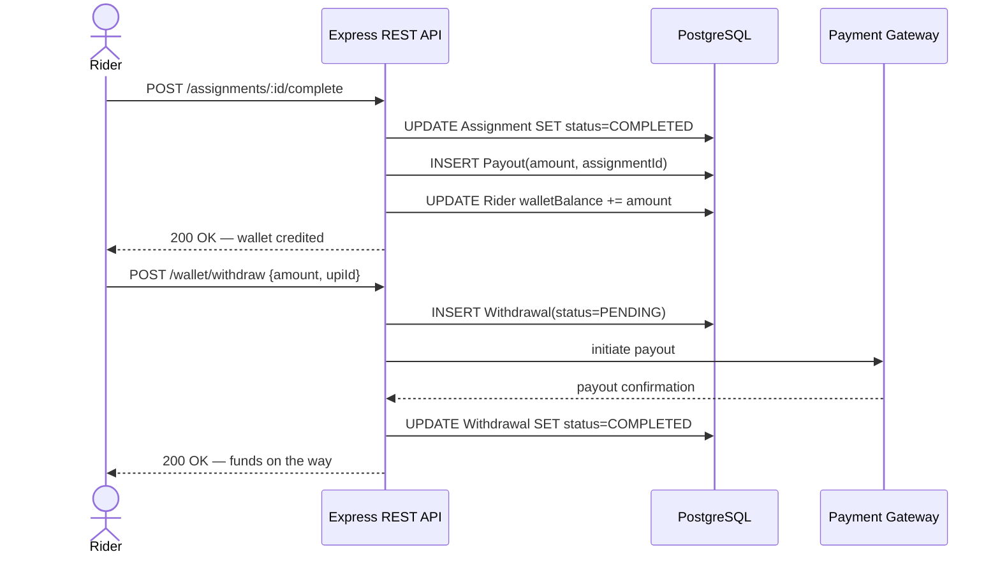
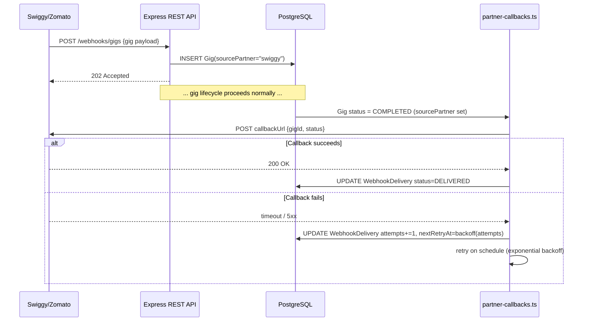
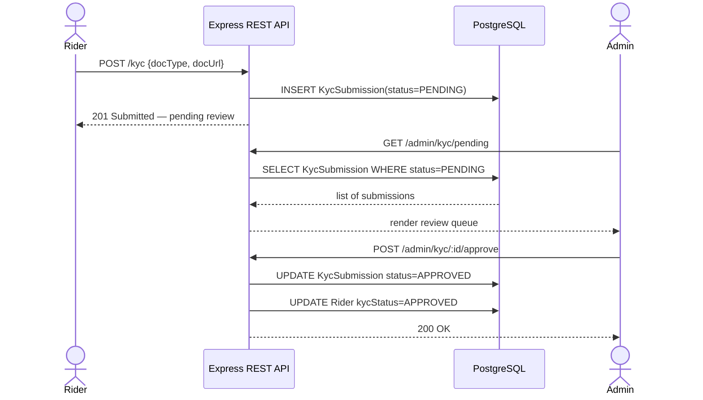

# 🚴 Gig Workforce Platform

> A real-time, end-to-end **Gig Management Operating System** connecting companies that need on-demand workers (delivery agents, task fulfillers) with verified riders ready to work.

[](https://nodejs.org)
[](https://www.typescriptlang.org)
[](https://react.dev)
[](https://www.postgresql.org)
[](https://redis.io)
[](https://socket.io)

---

## 📖 Table of Contents

- [Overview & Vision](#-overview--vision)
- [Key Features](#-key-features)
- [Tech Stack](#-tech-stack)
- [High-Level Design (HLD)](#-high-level-design-hld)
- [Low-Level Design (LLD)](#-low-level-design-lld)
- [Core Sequence Flows](#-core-sequence-flows)
- [Project Structure](#-project-structure)
- [Setup & Installation](#-setup--installation)
- [Usage & Demo Accounts](#-usage--demo-accounts)
- [Security & Authentication](#-security--authentication)
- [Future Scalability](#-future-scalability-considerations)
- [Troubleshooting](#️-troubleshooting)

---

## 🎯 Overview & Vision

The Gig Workforce Platform is designed as an **"Operating System" for gig workforce management**. It sits between two sides of a marketplace:

1. **Companies** — businesses (or aggregated external partners like Swiggy/Zomato via webhooks) that need immediate delivery or task fulfillment.
2. **Riders** — independent workers looking for gig opportunities in their vicinity.

The system is built around three pillars:

| Pillar | How it's achieved |
|---|---|
| **Real-Time** | Sub-200ms gig broadcasting over Socket.IO to online riders |
| **Trust** | Multi-document KYC verification gates access to critical gigs and withdrawals |
| **Settlement** | Digital wallet earnings with UPI withdrawal support |

---

## 🚀 Key Features

- **Real-Time Gig Broadcasting** — Socket.IO powered infrastructure delivers gig opportunities to online riders in milliseconds.
- **Smart Matchmaking** — an intelligent algorithm ranks gigs for each rider based on urgency, pay, distance, and platform tags.
- **Live Ops Map** — geospatial visualization of online riders, open gigs, and active deliveries for admins and companies.
- **Identity & Trust (KYC)** — multi-document verification (Aadhaar, PAN, DL) gates access to critical gigs and withdrawals.
- **Instant Payouts** — riders earn into a digital wallet, with built-in UPI withdrawal capability.
- **Multi-Platform Aggregation** — webhooks allow external partners (e.g., Swiggy, Zomato) to post gigs directly onto the platform.
- **Premium Design System** — dark-themed, glassmorphism UI with violet accents.

---

## 🛠 Tech Stack

### Frontend (Client)
| Concern | Choice |
|---|---|
| Framework | React 18 (functional components + hooks) |
| Build Tool | Vite |
| Styling | Tailwind CSS + custom CSS variables (glassmorphism theme), `clsx` for conditional classes |
| Routing | React Router v6 |
| Data Fetching | TanStack Query (React Query) |
| Real-Time | `socket.io-client` |

### Backend (Server)
| Concern | Choice |
|---|---|
| Runtime | Node.js |
| Web Framework | Express.js |
| Real-Time Server | Socket.IO |
| ORM | Prisma |
| Language | TypeScript (across the whole monorepo) |

### Infrastructure & Data
| Concern | Choice |
|---|---|
| Primary DB | PostgreSQL 16 — ACID compliance & relational integrity |
| Cache / Broker | Redis 7 — socket room fan-out & hot data caching |
| Containerization | Docker & Docker Compose (local Postgres + Redis) |
| Monorepo | npm workspaces (`apps/web`, `apps/api`, `packages/shared`) |
| Validation | Zod schemas shared between frontend and backend |

---

## 🏛 High-Level Design (HLD)

The architecture follows a **Client–Server model** augmented with a **real-time WebSocket layer** and an **external webhook ingestion layer**.



### Architectural Layers

| Layer | Responsibility |
|---|---|
| **Client Layer** | Three role-specific SPAs (Company, Rider, Admin) sharing one React codebase, gated by route |
| **API Layer** | Express REST endpoints for CRUD + business actions (auth, gigs, KYC, wallet) |
| **Real-Time Layer** | Socket.IO server pushing `gig:new`, `gig:updated`, `notification:new` events into role/user-scoped rooms |
| **Domain Layer** | Smart Matching Engine (scoring/ranking) + Partner Callback workers (webhook retries) |
| **Data Layer** | PostgreSQL as source of truth; Redis for socket-room fan-out and caching hot state (e.g., live rider locations) |
| **External Integrations** | Inbound gig webhooks (Swiggy/Zomato), outbound payout calls (Razorpay) |

### Key Flows (Summary)

1. **Gig Creation Flow** — a Company (or external webhook) posts a gig → API persists to Postgres → Realtime service instantly pushes the gig via WebSocket to all online Riders.
2. **Acceptance Flow** — a Rider accepts a gig → API checks for race conditions (already taken?) → assigns the gig → broadcasts `gig:updated` to remove it from other riders' boards.
3. **Payout Flow** — Rider completes a gig → assignment status changes → a `Payout` record is created → Rider requests withdrawal → (production) routed to a payment gateway like Razorpay.

---

## 🧩 Low-Level Design (LLD)

### Entity-Relationship Diagram



### Backend Module Breakdown



| Module | Responsibility |
|---|---|
| `routes/auth.ts` | JWT generation & login |
| `routes/gigs.ts` | CRUD for gigs; the POST endpoint that triggers WebSocket broadcasts |
| `routes/riders.ts` | Rider state management (online/offline toggle, location updates) |
| `realtime/socket.ts` | WebSocket hub — authenticates connections via JWT, joins users to rooms (`company_XYZ`, `rider_ABC`, `admin`), emits `gig:new` / `gig:updated` / `notification:new` |
| `services/smart-matching.ts` | Scores & sorts gigs per rider: urgency (CRITICAL weighted highest), pay bonuses, platform-tag overlap, geospatial distance |
| `services/partner-callbacks.ts` | Retry-worker — calls back partner URLs (e.g., Swiggy) on gig completion; failures tracked in `WebhookDelivery` with exponential backoff |

### Frontend Module Breakdown



| Module | Responsibility |
|---|---|
| `components/ui.tsx` | Bespoke design system on Tailwind — glassmorphism cards, gradient borders, reusable `Card`, `Button`, `SectionHeader`, `StatCard`, `Toast` |
| `context/AuthContext.tsx` | Global user state, login handling, JWT storage |
| `lib/socket.ts` | Singleton `socket.io-client` wrapper — auto-connects on login, listens for global events |
| `pages/LandingPage.tsx` | Marketing / value-prop site |
| `pages/LoginPage.tsx` | Split-screen authentication |
| `pages/RiderPage.tsx` | Live gig board, wallet balance, KYC status |
| `pages/CompanyPage.tsx` | Post gigs, view active fulfillment |
| `pages/AdminPage.tsx` | Live Ops Map, user management, KYC approvals |

---

## 🔄 Core Sequence Flows

### 1. Gig Creation & Real-Time Broadcast



### 2. Gig Acceptance (Race-Condition Safe)



### 3. Payout & Withdrawal



### 4. Partner Webhook Ingestion + Callback Retry



### 5. KYC Verification Flow



---

## 📦 Project Structure

```
GigWorkforceMgmt/
├── apps/
│   ├── api/                    # Express + Socket.IO Backend
│   │   ├── src/routes/         # REST endpoints (auth, gigs, riders, kyc, wallet, webhooks)
│   │   ├── src/realtime/       # WebSocket handlers (socket.ts)
│   │   └── src/services/       # Core business logic (smart-matching, partner-callbacks, payout)
│   └── web/                    # React + Vite Frontend
│       ├── src/components/     # UI and feature components
│       ├── src/pages/          # Route pages (Landing, Login, Rider, Company, Admin)
│       └── src/context/        # React Context (Auth)
├── packages/
│   └── shared/                 # Shared TS types, Zod schemas, and enums
├── prisma/                     # Prisma schema and seed scripts
├── docker-compose.yml          # Postgres and Redis definitions
└── package.json                # Monorepo (npm workspaces) configuration
```

---

## 📦 Setup & Installation

### Prerequisites
- Node.js v20+
- Docker Desktop (for Postgres & Redis)

### Quick Start

```bash
# 1. Clone & install dependencies
git clone https://github.com/nototiger0227/GigWorkforceMgmt.git
cd GigWorkforceMgmt
npm install

# 2. Environment variables
cp .env.example .env
cp .env.example prisma/.env

# 3. Start infrastructure (Postgres & Redis) — Docker Desktop must be running
npm run db:up

# 4. Initialize database (wait ~10s for Postgres, then migrate + seed)
npm run db:setup

# 5. Start dev servers (API + Web, concurrently)
npm run dev
```

---

## 🎮 Usage & Demo Accounts

Once running, access the web client at **`http://localhost:5173`**

Password for all demo accounts: `password123`

| Role | Email | Description |
|---|---|---|
| **Admin** | `admin@gig.local` | Full platform oversight, Live Ops Map, KYC approvals, dispatching |
| **Company** | `company-a@gig.local` | Post gigs, view analytics, manage zones |
| **Rider** | `rider1@gig.local` | Go online/offline, accept gigs, view wallet, submit KYC |

---

## 🔐 Security & Authentication

- **Authentication** — Stateless JWT. Issued on login, passed via `Authorization: Bearer <token>` header for REST calls and in the `auth` payload during Socket.IO connection.
- **Authorization** — Enforced at the route level via middleware (e.g., `requireRole(Role.ADMIN)`); frontend routes protected via `<ProtectedRoute>`.
- **Data Validation** — Zod schemas in `packages/shared` strictly validate incoming payloads before they touch the database.

---

## 📈 Future Scalability Considerations

| Area | Plan |
|---|---|
| **Geospatial Queries** | Move from string-based zones / basic math to **PostGIS** for performant `ST_DWithin` radius queries |
| **Horizontal Scaling** | Add a **Redis Adapter** for Socket.IO so events broadcast correctly across multiple Node.js instances |
| **Reliability** | Move payout processing and webhook retries to a proper queue (**RabbitMQ** / **AWS SQS**) to survive server restarts |

---

## ⚠️ Troubleshooting

**Connection refused (P1001)**
Ensure Docker Desktop is running and port `5432` is free.

**Migration drift**
If Prisma complains about migration history:
```bash
npm run db:up
npm run db:reset
```

---

## 📄 License

Not specified — add a `LICENSE` file to define usage terms.
